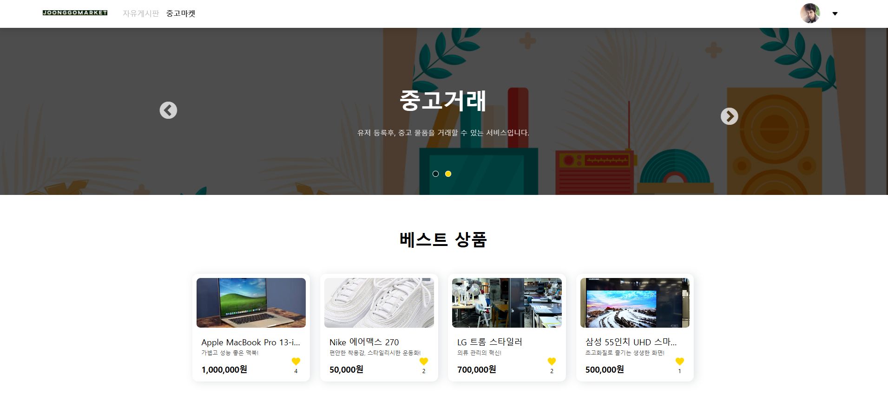

# MyPopol

링크 : [https://joonggomarket.site](https://joonggomarket.site)

## 1. 서비스 소개

- 유저인증없이 사용 가능한 게시판 기능
- 회원등록 후, 중고물품을 판매 & 구매
- 나의 사이트 방문자 수, 사이트를 통한 이메일 발신 수 확인
- 제공된 포트폴리오 사이트 메일 양식으로 방문자의 메일 수신

## 2. 서비스 소개

- 중고물품을 등록하고 구매하는 플랫폼 제공 서비스

## 3. 주요 기능

- **게시판 CRUD**: 유저 정보 없이 자유롭게 이용 가능한 게시판 기능 제공
- **중고물품 판매글 CRUD**: 회원 가입 후 이용 가능한 중고물품 등록, 수정, 삭제, 조회 기능
- **프로필 관리**: 회원 프로필 정보 생성 및 수정
- **회원 관리**: 회원 등록 및 인증 기능
- **댓글 CRUD**: 게시글에 댓글 작성, 수정, 삭제, 조회 기능
- **결제 연동**: PORTONE 서비스를 활용하여 결제 정보 연동

## 4. 사용 기술

